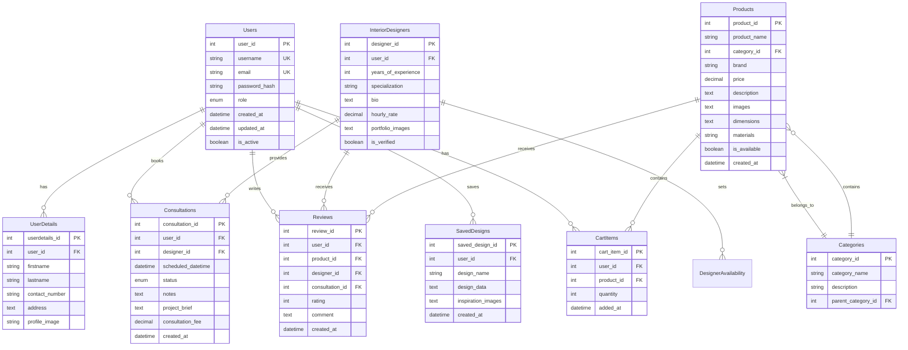

# DecorVista - Home Interior Design Web Application
## Comprehensive Architecture Plan

### 1. Project Overview

**Application Name:** DecorVista  
**Technology Stack:** React.js + Node.js/Express + MySQL  
**Architecture Pattern:** RESTful API with MVC Pattern  
**Development Approach:** Full-stack from scratch with responsive design

### 2. System Architecture

```
┌─────────────────┐    ┌─────────────────┐    ┌─────────────────┐
│   Frontend      │    │   Backend       │    │   Database      │
│   (React.js)    │◄──►│ (Node.js/Express)│◄──►│   (MySQL)       │
│                 │    │                 │    │                 │
│ - Components    │    │ - REST APIs     │    │ - User Data     │
│ - State Mgmt    │    │ - Authentication│    │ - Products      │
│ - Routing       │    │ - File Upload   │    │ - Consultations │
│ - Responsive UI │    │ - Business Logic│    │ - Reviews       │
└─────────────────┘    └─────────────────┘    └─────────────────┘
```

### 3. Database Design

#### 3.1 Core Entities and Relationships



### 4. API Architecture

#### 4.1 Authentication & Authorization
- **JWT-based authentication**
- **Role-based access control** (User, Designer, Admin)
- **Password hashing** with bcrypt
- **Session management**

#### 4.2 API Endpoints Structure

```
/api/v1/
├── auth/
│   ├── POST /register
│   ├── POST /login
│   ├── POST /logout
│   ├── POST /refresh-token
│   └── GET /verify-token
├── users/
│   ├── GET /profile
│   ├── PUT /profile
│   ├── GET /dashboard
│   └── DELETE /account
├── designers/
│   ├── GET /
│   ├── GET /:id
│   ├── PUT /profile
│   ├── POST /availability
│   └── GET /availability/:id
├── products/
│   ├── GET /
│   ├── GET /:id
│   ├── GET /categories
│   ├── GET /search
│   └── GET /filter
├── consultations/
│   ├── POST /book
│   ├── GET /user/:userId
│   ├── GET /designer/:designerId
│   ├── PUT /:id/status
│   └── DELETE /:id
├── reviews/
│   ├── POST /
│   ├── GET /product/:productId
│   ├── GET /designer/:designerId
│   └── PUT /:id
├── cart/
│   ├── GET /
│   ├── POST /add
│   ├── PUT /update/:itemId
│   └── DELETE /remove/:itemId
├── gallery/
│   ├── GET /inspirations
│   ├── POST /save-design
│   ├── GET /saved-designs
│   └── DELETE /saved-design/:id
├── uploads/
│   ├── POST /image
│   ├── POST /portfolio
│   └── POST /profile-picture
└── admin/
    ├── GET /users
    ├── GET /analytics
    ├── POST /content
    └── DELETE /user/:id
```

### 5. Frontend Architecture

#### 5.1 Component Structure
```
src/
├── components/
│   ├── common/
│   │   ├── Header.jsx
│   │   ├── Footer.jsx
│   │   ├── Sidebar.jsx
│   │   ├── LoadingSpinner.jsx
│   │   └── Modal.jsx
│   ├── auth/
│   │   ├── LoginForm.jsx
│   │   ├── RegisterForm.jsx
│   │   └── ProtectedRoute.jsx
│   ├── dashboard/
│   │   ├── UserDashboard.jsx
│   │   ├── DesignerDashboard.jsx
│   │   └── AdminDashboard.jsx
│   ├── products/
│   │   ├── ProductCatalog.jsx
│   │   ├── ProductCard.jsx
│   │   ├── ProductDetails.jsx
│   │   ├── SearchFilters.jsx
│   │   └── CategoryNav.jsx
│   ├── gallery/
│   │   ├── InspirationGallery.jsx
│   │   ├── ImageGrid.jsx
│   │   ├── SavedDesigns.jsx
│   │   └── DesignViewer.jsx
│   ├── consultations/
│   │   ├── BookingForm.jsx
│   │   ├── DesignerList.jsx
│   │   ├── DesignerProfile.jsx
│   │   ├── TimeSlotPicker.jsx
│   │   └── ConsultationHistory.jsx
│   ├── cart/
│   │   ├── ShoppingCart.jsx
│   │   ├── CartItem.jsx
│   │   └── CartSummary.jsx
│   └── reviews/
│       ├── ReviewForm.jsx
│       ├── ReviewList.jsx
│       └── RatingStars.jsx
├── pages/
│   ├── Home.jsx
│   ├── About.jsx
│   ├── Contact.jsx
│   ├── Products.jsx
│   ├── Gallery.jsx
│   ├── Designers.jsx
│   ├── Dashboard.jsx
│   └── Profile.jsx
├── hooks/
│   ├── useAuth.js
│   ├── useApi.js
│   ├── useCart.js
│   └── useLocalStorage.js
├── services/
│   ├── api.js
│   ├── auth.js
│   ├── upload.js
│   └── utils.js
├── context/
│   ├── AuthContext.js
│   ├── CartContext.js
│   └── ThemeContext.js
└── styles/
    ├── globals.css
    ├── components/
    └── responsive.css
```

#### 5.2 State Management Strategy
- **Context API** for global state (Auth, Cart, Theme)
- **Local state** with useState for component-specific data
- **Custom hooks** for reusable logic
- **Local storage** for persistence

### 6. Key Features Implementation Plan

#### 6.1 User Authentication System
- Registration with email verification
- Login with JWT tokens
- Role-based access (User/Designer/Admin)
- Password reset functionality
- Profile management

#### 6.2 Product Catalog System
- Hierarchical categories
- Advanced search and filtering
- Product details with image gallery
- Third-party purchase links
- Wishlist/favorites functionality

#### 6.3 Inspiration Gallery
- Image upload and management
- Category-based organization
- Save to personal collection
- High-quality image display
- Responsive image grid

#### 6.4 Consultation Booking System
- Designer profile browsing
- Availability calendar
- Booking management
- Status tracking
- Review and rating system

#### 6.5 Shopping Cart
- Add/remove products
- Quantity management
- Price calculations
- Persistent cart storage
- Checkout preparation

### 7. Security Considerations

#### 7.1 Authentication Security
- Password hashing with bcrypt
- JWT token expiration
- Refresh token rotation
- Rate limiting on auth endpoints

#### 7.2 Data Protection
- Input validation and sanitization
- SQL injection prevention
- XSS protection
- File upload security
- CORS configuration

#### 7.3 API Security
- Request rate limiting
- Authentication middleware
- Role-based authorization
- Secure headers implementation

### 8. Performance Optimization

#### 8.1 Frontend Optimization
- Code splitting and lazy loading
- Image optimization and lazy loading
- Caching strategies
- Bundle size optimization
- Progressive Web App features

#### 8.2 Backend Optimization
- Database indexing
- Query optimization
- Caching with Redis (optional)
- File compression
- CDN integration for static assets

### 9. Responsive Design Strategy

#### 9.1 Breakpoints
- Mobile: 320px - 768px
- Tablet: 768px - 1024px
- Desktop: 1024px+

#### 9.2 Mobile-First Approach
- Progressive enhancement
- Touch-friendly interfaces
- Optimized navigation
- Compressed images for mobile

### 10. Testing Strategy

#### 10.1 Frontend Testing
- Unit tests with Jest
- Component testing with React Testing Library
- Integration tests
- E2E tests with Cypress

#### 10.2 Backend Testing
- Unit tests with Jest
- API endpoint testing
- Database integration tests
- Authentication flow testing

### 11. Deployment Architecture

#### 11.1 Development Environment
- Local MySQL database
- Node.js development server
- React development server
- Environment variables management

#### 11.2 Production Deployment
- Cloud hosting (AWS/Heroku/DigitalOcean)
- Database hosting
- Static file CDN
- SSL certificate
- Domain configuration

### 12. Documentation Requirements

#### 12.1 Technical Documentation
- API documentation with Swagger
- Database schema documentation
- Component documentation
- Installation and setup guide

#### 12.2 User Documentation
- User manual for each role
- Feature walkthrough
- Troubleshooting guide
- Video demonstrations

### 13. Project Timeline Estimation

#### Phase 1: Foundation (Weeks 1-2)
- Project setup and configuration
- Database design and creation
- Basic authentication system

#### Phase 2: Core Backend (Weeks 3-4)
- User management APIs
- Product catalog APIs
- File upload system

#### Phase 3: Core Frontend (Weeks 5-6)
- Authentication UI
- Product catalog interface
- Basic responsive design

#### Phase 4: Advanced Features (Weeks 7-8)
- Consultation booking system
- Review system
- Shopping cart functionality

#### Phase 5: Polish & Testing (Weeks 9-10)
- UI/UX refinements
- Testing and bug fixes
- Documentation and deployment

### 14. Success Metrics

#### 14.1 Technical Metrics
- Page load time < 3 seconds
- Mobile responsiveness score > 95%
- API response time < 500ms
- Zero critical security vulnerabilities

#### 14.2 Functional Metrics
- All user journeys working end-to-end
- Cross-browser compatibility
- File upload success rate > 99%
- Authentication system reliability

This comprehensive architecture plan provides a solid foundation for building the DecorVista application with all the specified requirements while maintaining scalability, security, and performance standards.
