# DecorVista User Flows and System Workflows

## 1. Homeowner User Journey Flow

### 1.1 Registration and Authentication Flow
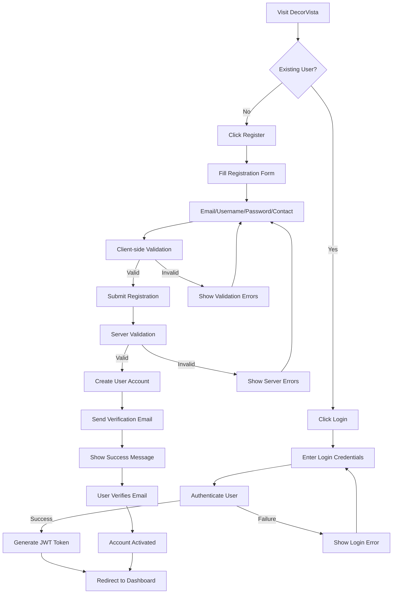

### 1.2 Product Exploration and Shopping Flow
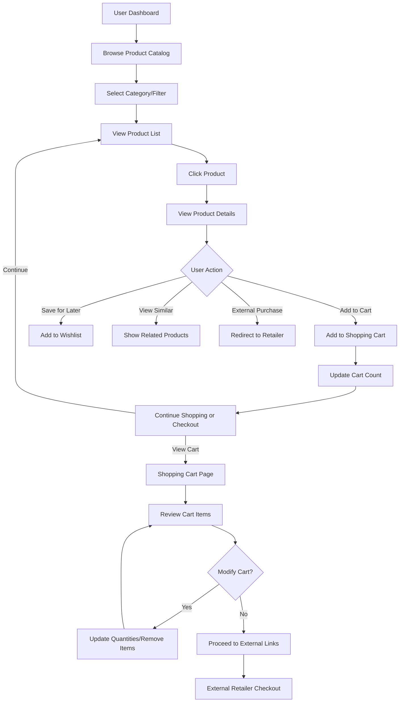

### 1.3 Inspiration Gallery and Design Management Flow
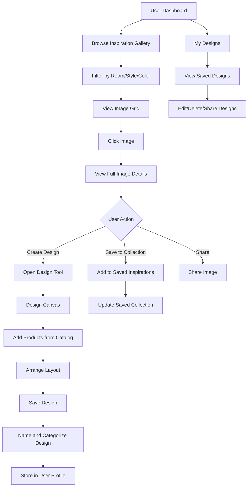

### 1.4 Consultation Booking Flow
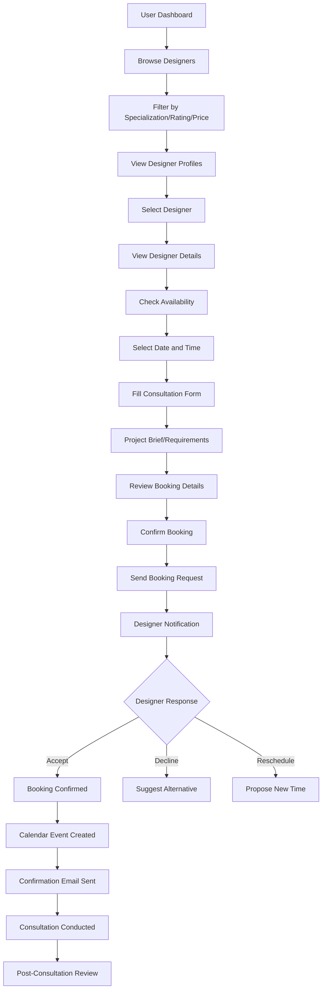

## 2. Interior Designer User Journey Flow

### 2.1 Designer Registration and Profile Setup Flow
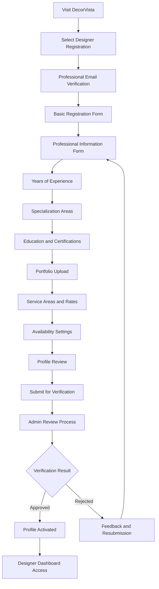

### 2.2 Consultation Management Flow
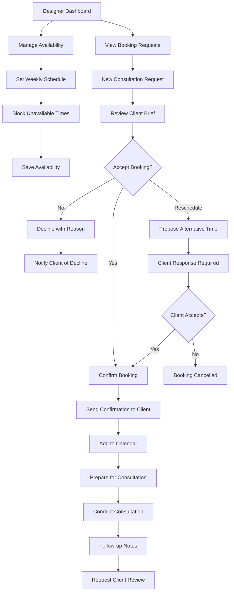

### 2.3 Client Interaction and Portfolio Management Flow
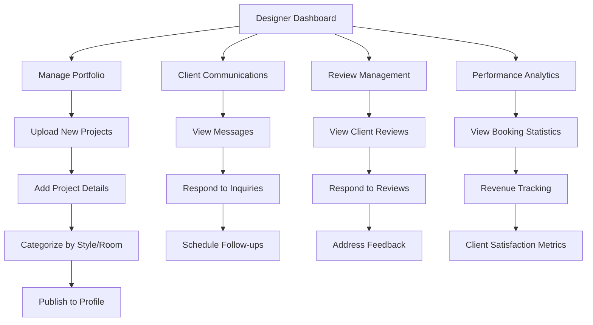

## 3. Admin User Journey Flow

### 3.1 Admin Dashboard and User Management Flow
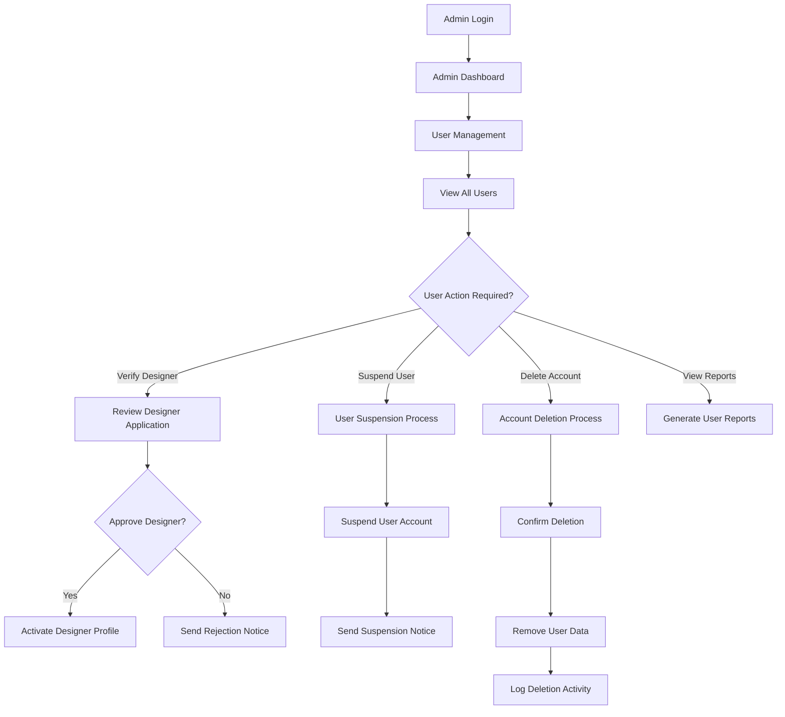

### 3.2 Content Management Flow
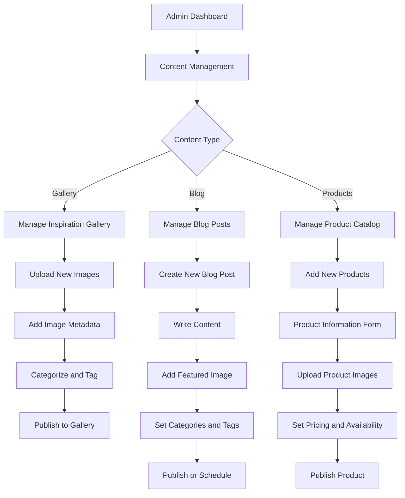

## 4. System Integration Workflows

### 4.1 Authentication and Authorization Workflow
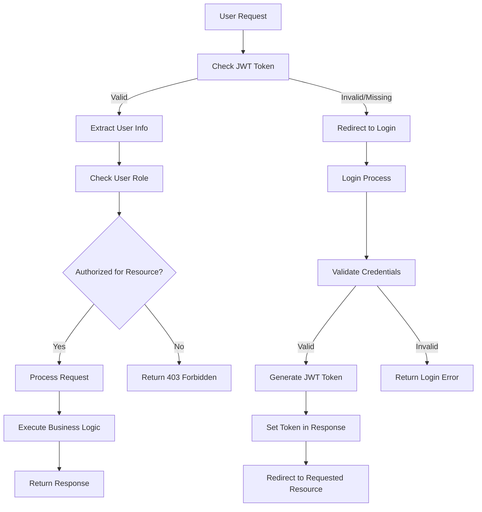

### 4.2 File Upload and Processing Workflow
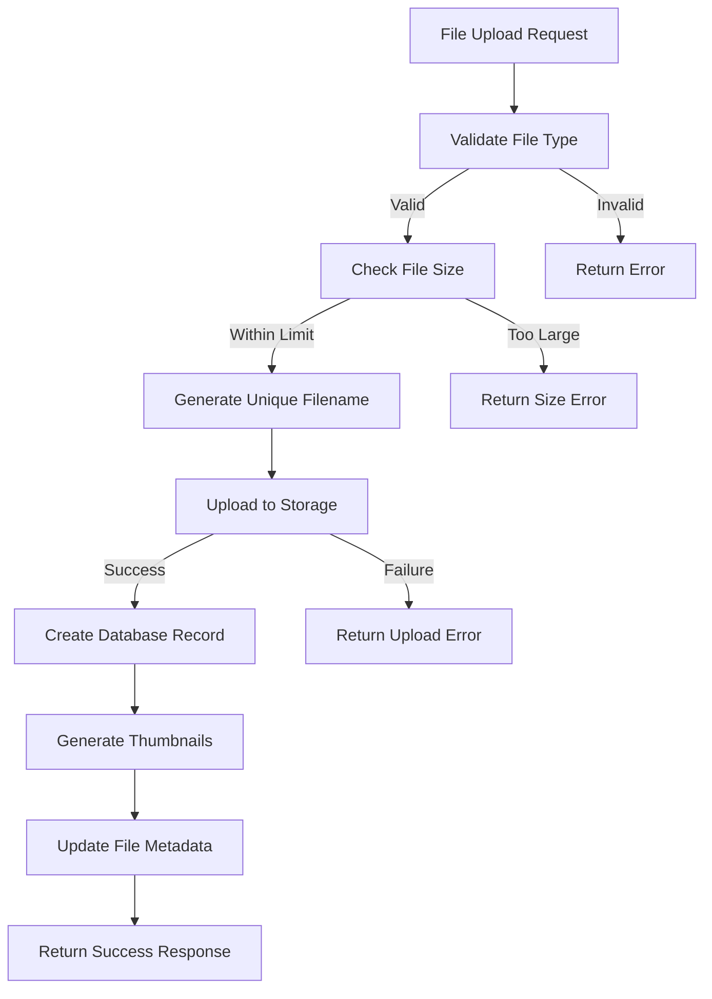

### 4.3 Search and Filter Workflow
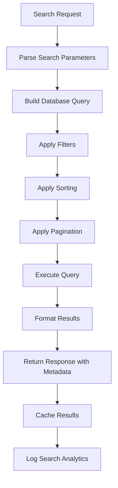

## 5. Error Handling and Recovery Flows

### 5.1 Database Connection Error Flow
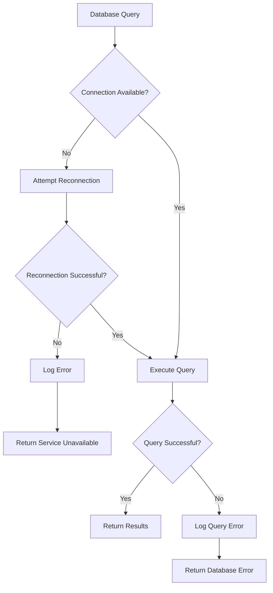

### 5.2 File Upload Error Handling Flow
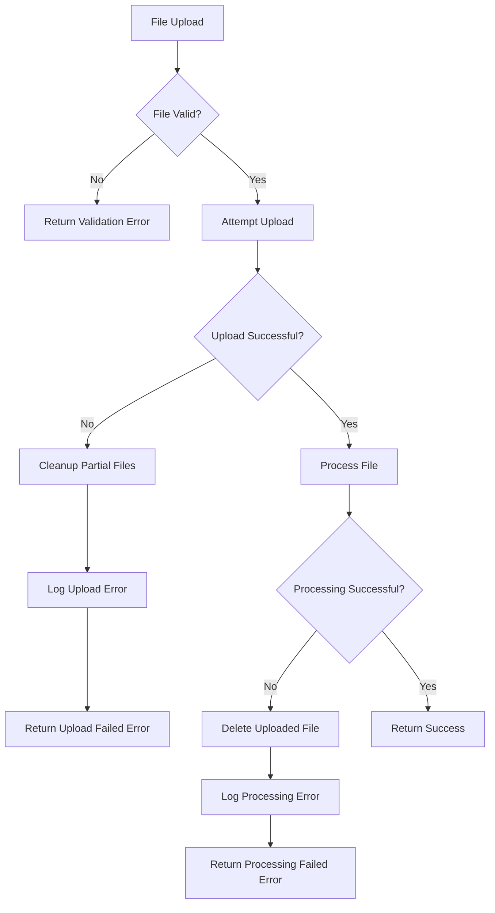

## 6. Performance Optimization Workflows

### 6.1 Caching Strategy Flow
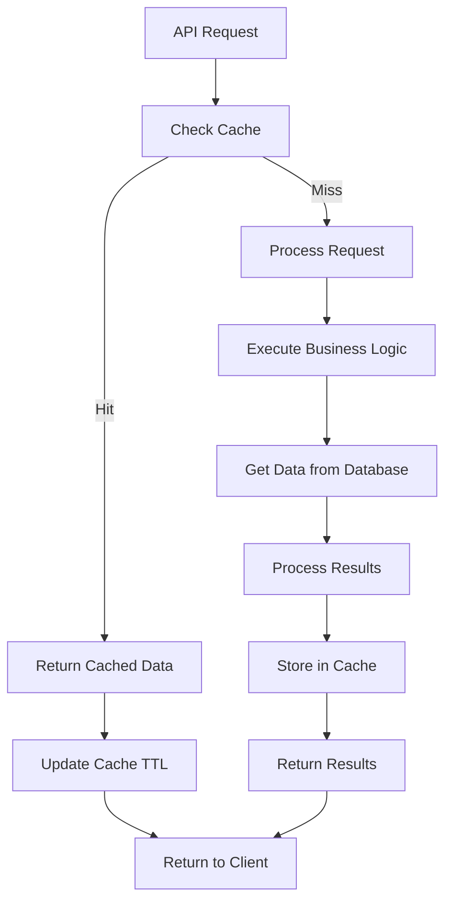

### 6.2 Image Optimization Workflow
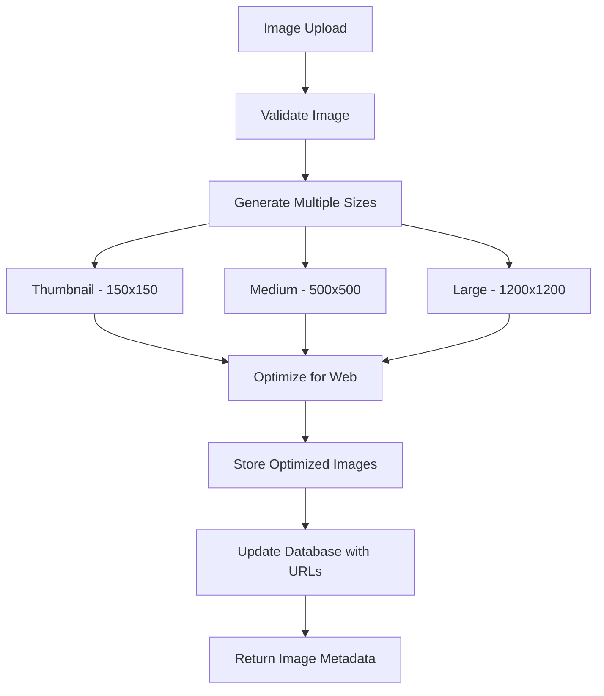

This comprehensive workflow documentation covers all major user journeys and system processes for the DecorVista application, ensuring smooth user experiences and robust system operations.